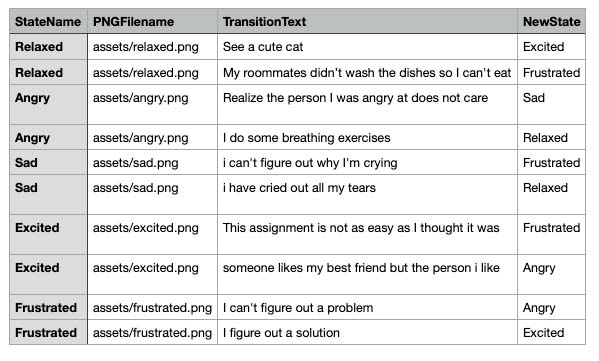

## MoodStateMachine
#### by Scott Kildall
#### Last updated Jan 24 2022

### Overview
This is a simple state machine that displays an image and a series of transitions that can lead to new states. It uses the p5.simpleStateManager.js library file, which does the heavy lifting: loading a CSV file with the various states and transitions in it.

### Add to your index.html:

 

 This lets you use the code in the p5.simpleStateManager.js library

### p5.simpleStateManager.js

 This is a library that loads a csv file for images + texts + states. The implementation destails are in the source code file and here is what we need to know.

### CSV file format

Each row details:
(1) start state name
(2) local PNG or JPG file
(3) transition text, which will be part of the UI
(4) the state that you will go to with this transition

Things will be redundant, meaning that we will have duplicate PNG filenames. That's fine.

Be careful with the spelling of each state and the exact filename path.

### library functions

The p5.simpleStateManager has 3 entry points:

(1) constructor(statesFilename)

Expects a CSV file in the constuctor, such as:

`simpleStateMachine = new SimpleStateManager("assets/moodStates.csv");
`

(2) setup(imageFilenameCallback, transitionsArrayCallback)

Expects two callback functions, one for setting the image filename and one for setting an array of transitions.

`simpleStateMachine.setup(setImage, setTransitionNames);`

the actual functions might look something like:

function setImage(imageFilename) {
  moodImage = loadImage(imageFilename);
} 

function setTransitionNames(transitionArray) {
  transitions = transitionArray;
}

This callbacks get called upon (1) setup (above) or (2) going to a new state (below)

(3) newState(transitionName)

Based on the name of the transition, will send you to a new state. 

 `simpleStateMachine.newState(transitions[selectedTransitionNum]);
 `
### Technical Details

You can use this as a template. Underneath the comments below, you can modify the UI elements.

//==== MODIFY THIS CODE FOR UI =====/